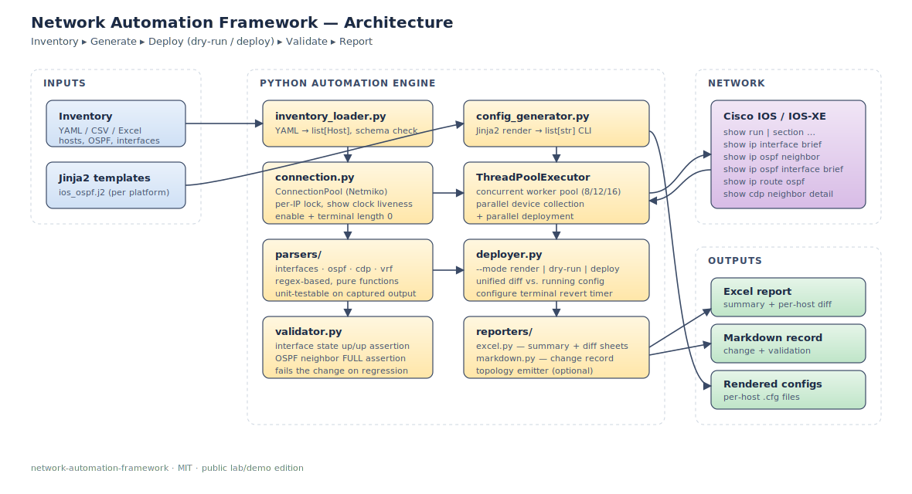
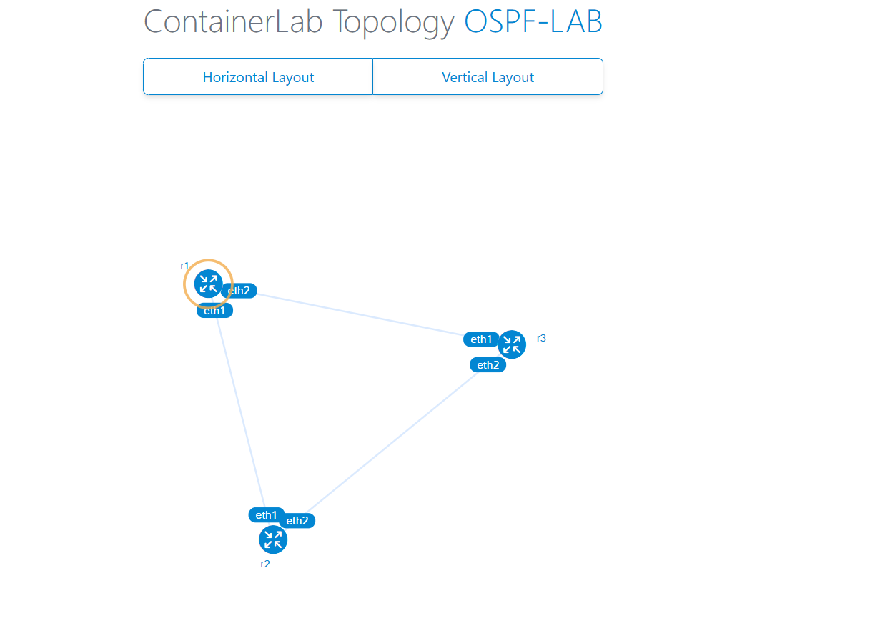
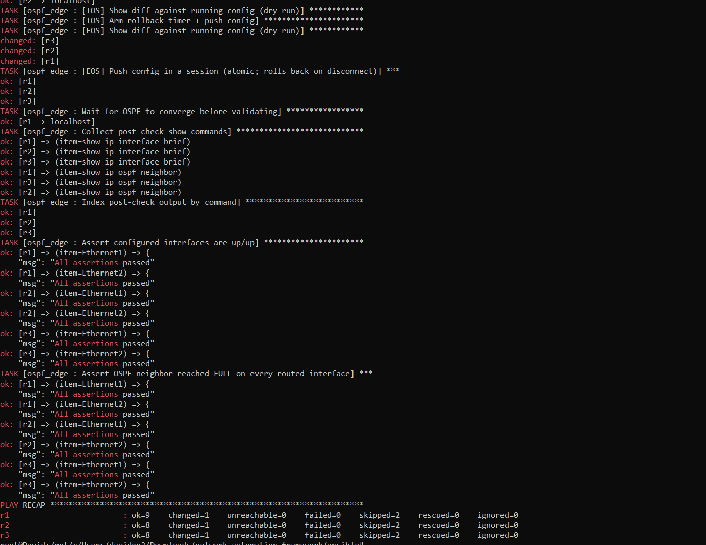

# Network Automation Framework

Lab-grade network automation framework inspired by real-world migration tooling.
It demonstrates concurrent Cisco device collection, Jinja2 config generation,
OSPF deployment workflows, post-change validation, and structured reporting.

> This is a **public lab/demo** project. It contains no production data,
> credentials, or customer-specific logic. Everything ships with documented
> RFC1918 sample inventories and IOS-style fixtures.

---

## Why this exists

Read-only audit tools are common; what's less common in small shops is a
framework that uses the **same parsers and the same connection layer** for
discovery and for change deployment. This project shows that pattern end to
end:

1. Load a YAML inventory.
2. Render Cisco IOS config from Jinja2 templates.
3. Push the config through a thread-safe Netmiko connection pool, with a
   `--mode dry-run` that only diffs and a `--mode deploy` that uses the IOS
   `configure terminal revert timer` rollback safety net.
4. Run post-checks (`show ip interface brief`, `show ip ospf neighbor`,
   `show ip ospf interface brief`, `show ip route ospf`,
   `show running-config | section router ospf`).
5. Produce a Markdown change record and an Excel report.

## Architecture



## Repo layout

```
network-automation-framework/
├── main.py                       # CLI entry
├── requirements.txt
├── src/
│   ├── connection.py             # ConnectionPool (Netmiko)
│   ├── inventory_loader.py       # YAML -> list[Host]
│   ├── config_generator.py       # Jinja2 rendering
│   ├── deployer.py               # dry-run + deploy with rollback
│   ├── validator.py              # post-check assertions
│   ├── parsers/                  # show output parsers
│   │   ├── interfaces.py
│   │   └── ospf.py
│   └── reporters/
│       ├── markdown.py
│       └── excel.py
├── templates/
│   └── ios_ospf.j2               # device template
├── examples/
│   ├── inventory.yml             # 3 sanitized lab routers
│   └── rendered_lab-edge-r1.cfg  # what the template emits
├── docs/
│   └── architecture.svg
├── outputs/                      # runtime artifacts (gitignored)
└── tests/
    └── test_parsers.py
```

## Quick start

```bash
pip install -r requirements.txt

# 1. Render configs only (no devices needed) — useful for review/code-review
python main.py --inventory examples/inventory.yml --mode render

# 2. Dry-run against real devices: connects, fetches running config, prints diff
python main.py --inventory examples/inventory.yml --mode dry-run

# 3. Deploy with rollback timer + post-validation
python main.py --inventory examples/inventory.yml --mode deploy
```

Credentials are read from environment variables:

```
NET_USER, NET_PASS, NET_SECRET
```

## Inventory format

See [`examples/inventory.yml`](examples/inventory.yml). Each host declares its
management IP, a loopback (used as OSPF router-id), an OSPF process ID, and
up to N routed interfaces. Interfaces can carry per-link MD5 authentication
parameters.

## What's intentionally out of scope

- Real device drivers beyond Cisco IOS / IOS-XE.
- Config drift remediation (this only deploys the intended state).
- A full topology renderer — the parsers expose enough data for one, but it's
  not built in.

## Containerlab integration lab

Spin up a 3-node Arista cEOS topology in Docker and run the same Ansible
role against real virtual routers — production targets Cisco IOS, the lab
targets EOS for portability (cEOS is freely downloadable; Cisco IOSv/CML
images are not). See [`lab/README.md`](lab/README.md) for the full setup.

```bash
cd lab
make up        # 3 cEOS containers, ~30s
make deploy    # render + push OSPF + assert neighbors reach FULL
make destroy
```

Live topology view (`containerlab graph`) and full deploy run, end-to-end
green against three live virtual routers:

| Lab topology | Deploy + validation |
|:---:|:---:|
|  |  |

A GitHub Actions workflow at `.github/workflows/integration.yml` runs the
same flow in CI when a `CEOS_IMAGE_URL` repository secret is configured.

## Ansible equivalent

The same `render → dry-run → deploy → validate` workflow is also implemented
as an Ansible role under [`ansible/`](ansible/), so you can compare the two
approaches. Both share the same Jinja2 template content and the same
inventory shape. See [`ansible/README.md`](ansible/README.md) for a
side-by-side trade-off table.

## Inspiration / prior work

This framework is the public, sanitized version of operational tooling I've
built and used in real Cisco-environment work. The interesting design choices
— per-IP locked connection pool, classifier precedence in the parsers,
deterministic reporting — come from that experience.

## License

MIT — see [LICENSE](LICENSE).
